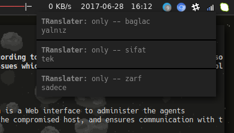

# TRanslater


Yabancı kelimeleri Türkçeye çevirin !

  - Google Translate alt yapısı
  - Clipboard listener
  - Yabancı dökümanları hızlıca okuyun
  - Bildirim özelliği(Sadece Linux)

### Harici kütüphaneler
- pyperclip
- googletrans
- colorama

### İhtiyaçlar

- xclip paketini kurmanız gerekmekte.
- notify-send programı linuxta yüklü olması gerekmekte

```sh
$ cd TRanslater
$ python2 translate.py
```

Veritabanını temizlemek için

```sh
$ python2 translate.py --clean
```

### Eklemeyi düşündüklerim

- Widget özelliği olabilir (Arayüz)
- Veritabanını üzerinde daha fazla işlem sağlamak
- Log tutturmak


### Geliştirme

Şimdilik birazcık karmaşık gelebilir ilk kullanılabilir versionunu 
çıkardık. 

Daha sistematik ve modüler yapacağım umarım :p

## Ekran Görüntüleri



2.seferde aynı kelimeyi veritabanından çeker


Lisans
----

MIT


